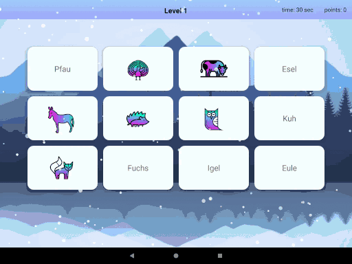

# DoubleSpeak 

A super-ultra-awesome language learning memory game android app

## Preview
 

## Concept Game Mechanic
a mix between a memory game and some akin to Candy Crush. 

  

## Responsibilities

### Vera
Architecture 

### Zofi
Design

### Itamar
Presentation Logic

### Yuri
Animations

### Roman
Maintainer

## Planned Features 
1. more words and images
2. more languages
3. highscore/statistics/achievement feature and persistence
4. candycrush (new card swap in and shuffle) functionality
5. improved risk/reward game mechanics
6. improved/more feedback features and animations ('sweet!', score after card pop, animated animals, etc).
6. multi-platform release (Tablet, TV, Wear, etc).
7. multiplayer
8. cloud accounts
